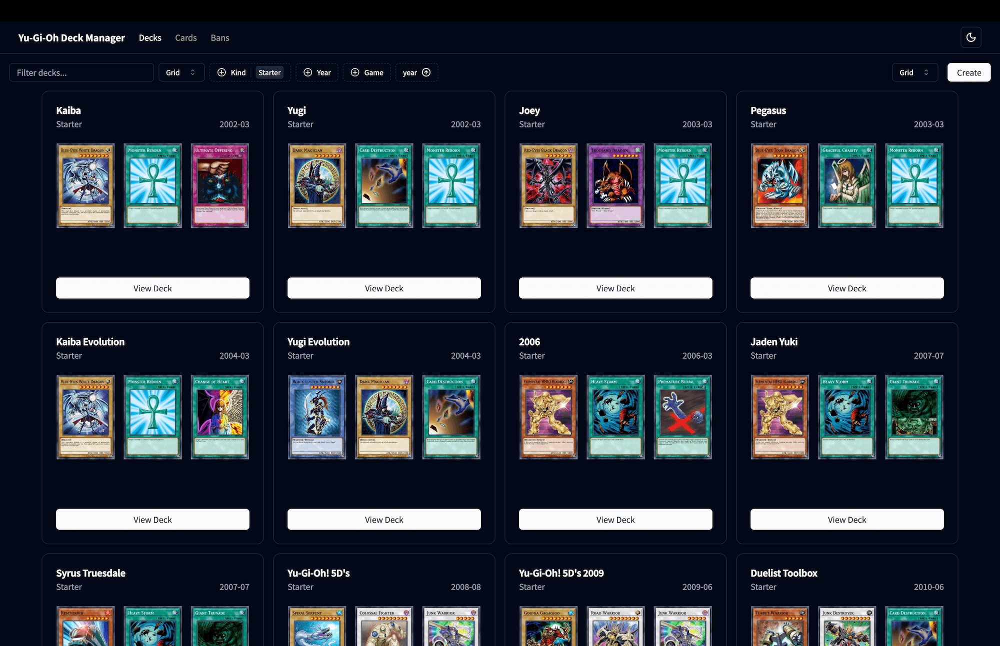
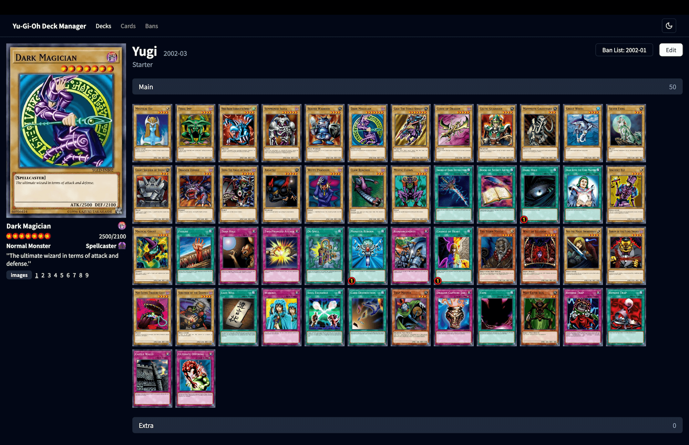
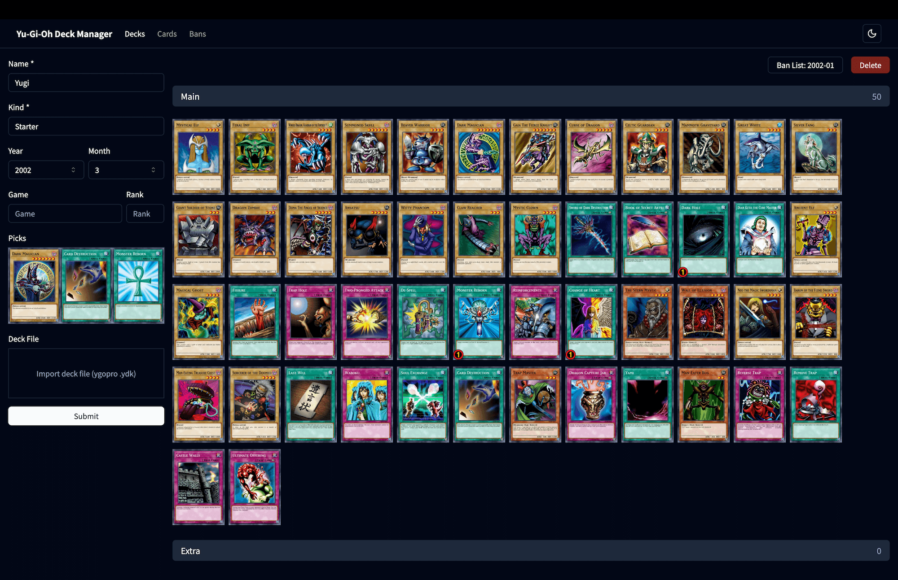
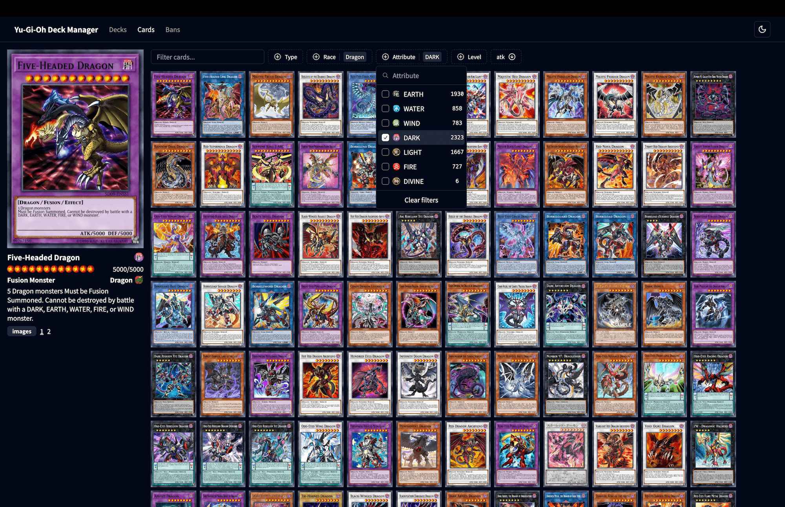
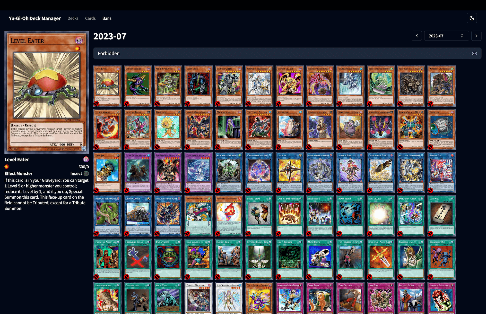

# Yu-Gi-Oh Deck Manager

Manage your Yu-Gi-Oh deck in a local environment.

## Feature

- Manage deck list via files
- Import `.ydk` files
- Edit deck metadata
- Filter/Sort deck lists
- Filter/Sort card lists
- View Ban lists

## Usage

### Data Setup

#### Data Layout

```
├── data               # All data goes here (ignored by git)
│   ├── decks          # contains deck files
│   │   ├── **/*.json  # deck file
│   ├── cards.json     # cards data file
│   ├── bans.json      # bans data file
├── public             # Next.js static serving directory
│   ├── images         # contains card images
│   │   ├── *.jpg      # card image file
├── langs              # contains language specific files
│   ├── attribute.json # attribute translations file
│   ├── race.json      # race translations file
└── assets             # contains static assets (mostly icons)
```

#### Fetching Card Data

```bash
node scripts/download_cards.js data/
```

Save the results of calling the [YGOPRODECK API](https://ygoprodeck.com/api-guide/) to the `data/cards.json` file.

This file will be used as a reference to check the card ID of the deck.

#### Fetching Card Images

**Option 1 - Download from the Release page**

Download the `images.zip` file from the [Release]() page and unzip it in the `public/` directory.

**Option 2 - Direct download via script file**

```bash
node scripts/download_images.js data/cards.json public/images/
```

Retrieve and save the card images from the image URLs in the `data/cards.json` file to the `public/images/` directory.

The image files follow the `{cardId}.jpg` naming convention.

#### Fetching Ban Data

```bash
node scripts/download_bans.js data/
```

Save the results of calling the [YGOPRODECK API](https://ygoprodeck.com/api-guide/) to the `data/bans.json` file.

This file will be used to implement the Ban list.

#### Language Setup

Although most of the operations are independent of the language in the `data/cards.json` file, you might need translation files to display icons for the card's `race`/`attribute` information.

If you're using a non-English translated `data/cards.json` file (like I am), you'll need to add the necessary translations to the `langs/attribute.json` and `langs/race.json` files. Please refer to these files for guidance.

### Execution

Prerequisites: Node.js v16.8+

```bash
# Build
npm run build

# Start Server
npm run start
```

Then, access the `http://localhost:3000` address using your web browser.

## Implementation Details

This project utilizes the [App Router](https://nextjs.org/docs/app/building-your-application/routing) of [Next.js](https://github.com/vercel/next.js). Depending on the domain's use case, it differentiated the use of [Server/Client Component](https://github.com/reactjs/rfcs/blob/main/text/0188-server-components.md) and [Dynamic/Static Rendering](https://nextjs.org/docs/app/building-your-application/rendering/static-and-dynamic).

### Decks (Dynamic/Active)

- **Dynamic**: Data changes frequently.
- **Active**: Interactions like filtering/sorting occur frequently.

#### Dynamic Rendering

Deck data can be created, modified, and deleted, so it cannot be permanently cached on the server. To always reflect the changing data, filtering/sorting information is handled via [URL SearchParams](https://nextjs.org/docs/app/building-your-application/rendering/static-and-dynamic#dynamic-functions). Therefore, the deck list page opts out of the [Full Route Cache](https://nextjs.org/docs/app/building-your-application/caching#full-route-cache) and always renders dynamically at request time. Since the filtering/sorting information is accessible in the server component through searchParams, only necessary data can be passed to the client component.

#### Cache Sorted Result

To avoid redundant sort requests during dynamic rendering, the server caches the deck list sort results. Since it directly accesses the file to manage the data, the [fetch](https://nextjs.org/docs/app/api-reference/functions/fetch) function cannot be used. A simple memory cache was implemented instead. The cache is revalidated when deck data changes.

### Cards (Static/Active)

- **Static**: Data doesn't change.
- **Active**: Interactions like filtering/sorting occur frequently.

#### Static Rendering & Client Component

Card data is static, so the card list page was rendered statically to be cached in the Full Route Cache. However, the card list page frequently uses filters/sorts, so filtering/sorting cached data is handled inside the client component.

### Bans (Static/Passive)

- **Static**: Data doesn't change.
- **Passive**: No interactions occur.

#### Build Time Static Rendering

Since the Ban data is static and doesn't change, and there are no interactions in each page, the [generateStaticParams](https://nextjs.org/docs/app/api-reference/functions/generate-static-params) function was used to render all the ban data pages at build time.

## References

- [shadcn/ui](https://ui.shadcn.com/): Awesome components! I also received a lot of help from their website examples.
- [yugiohprodeck](https://ygoprodeck.com/api-guide/): THE DATABASE of Yu-Gi-Oh cards and decks.
- [yugioh fandom wiki](https://yugioh.fandom.com/): High quality icon assets.

## Screenshots

  
  
  
  

